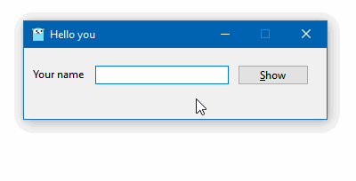

[](https://pkg.go.dev/github.com/rodrigocfd/windigo)
[](https://github.com/rodrigocfd/windigo)
[](https://github.com/rodrigocfd/windigo)
[](https://opensource.org/licenses/MIT)

# Windigo

Win32 API and GUI in idiomatic Go.

## Overview

The UI library is divided in the following packages:

| Package | Description |
| - | - |
| `ui` | High-level UI wrappers for windows and controls. |
| `ui/wm` | High-level event parameters (Windows message callbacks). |

For the Win32 API bindings:

| Package | Description |
| - | - |
| `win` | Native Win32 structs, handles and functions. |
| `win/co` | Native Win32 constants, all typed. |
| `win/errco` | Native Win32 [error codes](https://docs.microsoft.com/en-us/windows/win32/debug/system-error-codes), with types `errco.ERROR` and `errco.CDERR`. |

And for the COM bindings:

| Package | Description |
| - | - |
| `win/com/autom` | Native Win32 Automation COM interfaces. |
| `win/com/autom/automco` | Automation constants, all typed. |
| `win/com/autom/automvt` | Automation virtual tables. |
| `win/com/dshow` | Native Win32 DirectShow COM interfaces. |
| `win/com/dshow/dshowco` | DirectShow constants, all typed. |
| `win/com/dshow/dshowvt` | DirectShow virtual tables. |
| `win/com/idl` | Native Win32 Object IDL COM interfaces. |
| `win/com/idl/idlco` | IDL constants, all typed. |
| `win/com/idl/idlvt` | IDL virtual tables. |
| `win/com/shell` | Native Win32 Shell COM interfaces. |
| `win/com/shell/shellco` | Shell constants, all typed. |
| `win/com/shell/shellvt` | Shell virtual tables. |

Windigo is designed to be familiar to Win32 programmers, using the same concepts, so most C/C++ Win32 tutorials should be applicable.

Windows and controls can be created in two ways:

* programmatically, by specifying the options used in the underlying [CreateWindowEx](https://docs.microsoft.com/en-us/windows/win32/api/winuser/nf-winuser-createwindowexw);
* by loading resources from a `.rc` or a `.res` file.

CGo is **not** used, just syscalls.

## Error treatment

The native Win32 functions deal with errors in two ways:

* Recoverable errors will return an `errco.ERROR` value, which implements the [`error`](https://golang.org/pkg/builtin/#error) interface;

* Unrecoverable errors will simply **panic**. This avoids the excess of `if err != nil` with errors that cannot be recovered anyway, like internal Windows errors.

## Example

The example below creates a window programmatically, and handles the button click. Also, it uses the `minimal.syso` provided in the [resources](resources/) folder.



```go
package main

import (
    "fmt"
    "runtime"

    "github.com/rodrigocfd/windigo/ui"
    "github.com/rodrigocfd/windigo/win"
    "github.com/rodrigocfd/windigo/win/co"
)

func main() {
    runtime.LockOSThread()

    myWindow := NewMyWindow() // instantiate
    myWindow.wnd.RunAsMain()  // ...and run
}

// This struct represents our main window.
type MyWindow struct {
    wnd     ui.WindowMain
    lblName ui.Static
    txtName ui.Edit
    btnShow ui.Button
}

// Creates a new instance of our main window.
func NewMyWindow() *MyWindow {
    wnd := ui.NewWindowMain(
        ui.WindowMainOpts().
            Title("Hello you").
            ClientArea(win.SIZE{Cx: 340, Cy: 80}).
            IconId(101), // ID of icon resource, see resources folder
    )

    me := &MyWindow{
        wnd: wnd,
        lblName: ui.NewStatic(wnd,
            ui.StaticOpts().
                Text("Your name").
                Position(win.POINT{X: 10, Y: 22}),
        ),
        txtName: ui.NewEdit(wnd,
            ui.EditOpts().
                Position(win.POINT{X: 80, Y: 20}).
                Size(win.SIZE{Cx: 150}),
        ),
        btnShow: ui.NewButton(wnd,
            ui.ButtonOpts().
                Text("&Show").
                Position(win.POINT{X: 240, Y: 19}),
        ),
    }

    me.btnShow.On().BnClicked(func() {
        msg := fmt.Sprintf("Hello, %s!", me.txtName.Text())
        me.wnd.Hwnd().MessageBox(msg, "Saying hello", co.MB_ICONINFORMATION)
    })

    return me
}
```

## License

Licensed under [MIT license](https://opensource.org/licenses/MIT), see [LICENSE.md](LICENSE.md) for details.
